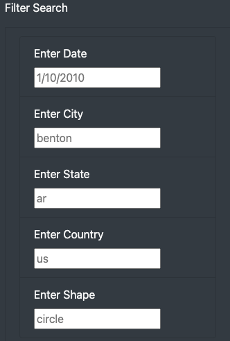
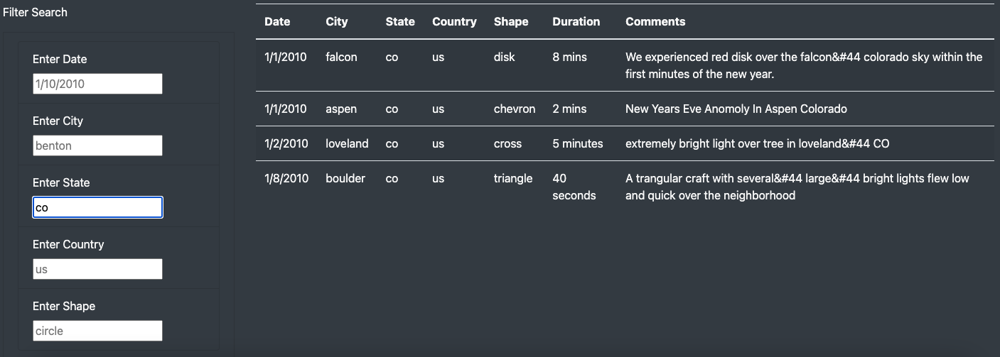
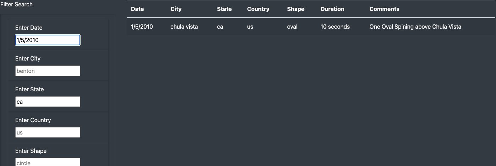

# UFOs

## Overview of Project
  The purpose of this challenge was to take the UFO sighting data and make a useable app to filter the data. JavaScript was used to allow the webpage to apply the filters correctly and a css was used to stylize the homepage to make it appear organized and clear.

## Results
On the left, there is a fully functional filter search bar. In it, you can see date, time, city, state, country, and shape.
Placing the correct input into one of the criteria will allow the data to filter almost immediately.

The filter bar also allows multiple filters to be used at once.

## Summary
The biggest drawback to this design is that when you have to filter multiple search options it does not have an autofill feature to easily combine two or more filters together. For example, if a state was typed in when the city box is clicked on, it should give all the options that the data has available.

One way to improve the webpage would be to add a count of all the hits your filter has received. As of right now, the only way would be to manually count them out.
Another simple way to improve the filter bar would be to include a feature that helps with the case sensitivity. Unfortunately, when any of the criterias are typed incorrectly, not only will it not work, but it also does not have any way to show mistypes.

